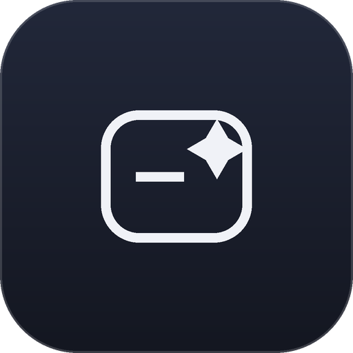
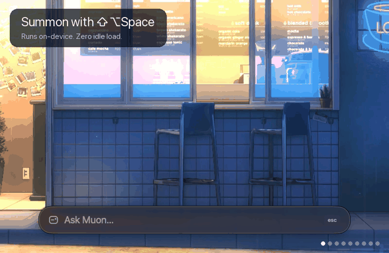
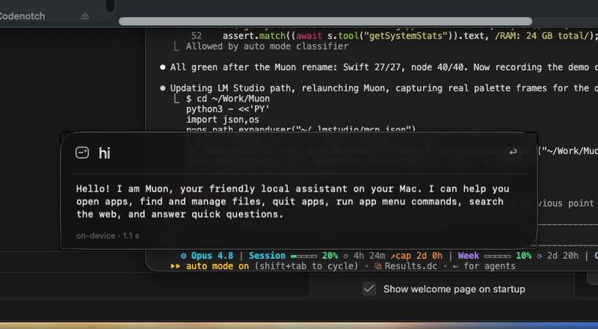
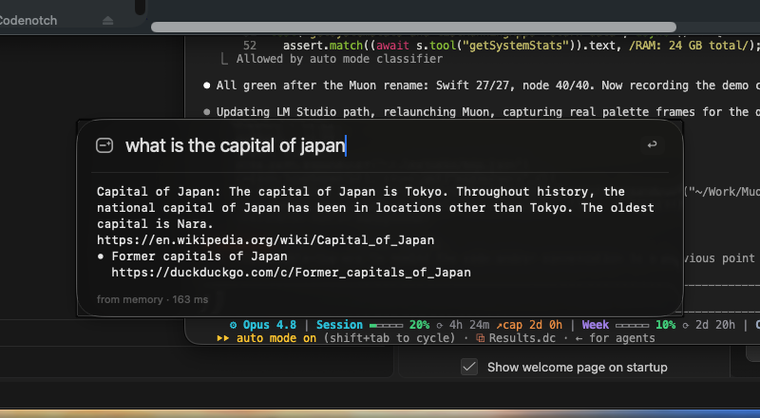
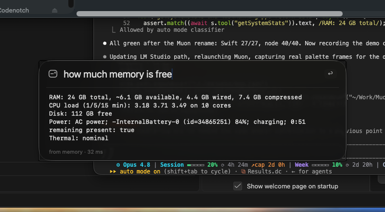
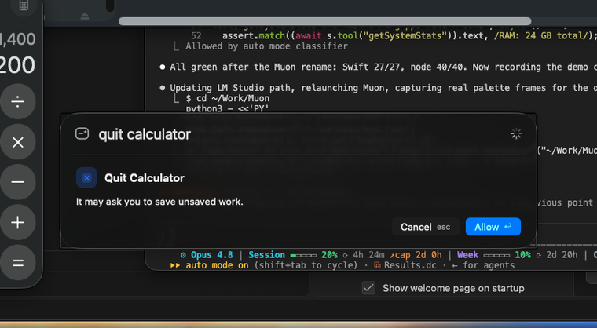

<div align="center">



# Muon

**A local, offline AI agent for macOS.** Summon a Liquid Glass palette with a keystroke to open apps, find and manage files, control any app's menus, search the web, and answer quick questions — running on-device, with zero idle footprint.

[](LICENSE)




</div>

## Why Muon

A muon is a fast, short-lived particle: it appears, does its thing, and is gone. Muon works the same way. It sits idle in your menu bar using almost no memory, loads a model only when you ask something, and unloads it when you're done. Your files, your commands, and (by default) your model never leave the Mac.

- **On-device first.** Simple requests are answered by Apple's built-in model in about a second, using no app memory. A local LM Studio model is loaded only for multi-step reasoning, and only when your Mac can spare the memory.
- **It learns, and gets cheaper.** Repeated commands are answered from a tiny local cache in milliseconds with no model at all. The more you use it, the less work it does.
- **Safe by construction.** The model never gets a shell. Every action is a typed tool with a path policy; anything that changes your files or controls an app asks first.

## Demo

| Summon | Chat | Web search |
|---|---|---|
|  |  |  |

| Answer about your Mac | Confirm before acting |
|---|---|
|  |  |

## How it works

```
  ⌃⌥Space  ──▶  Liquid Glass palette
                     │
        ┌────────────┼─────────────────────────────┐
        ▼            ▼                              ▼
   Tier 0        Tier 1                         Tier 2
   memory        Apple on-device model          LM Studio (MLX), on demand
   (SQLite,      (~1 s, 0 app RAM,              (loaded only when the Mac can
    0 ms)         single-step + chat)            afford it; auto-unloads)
        └────────────┴──────────────┬────────────────┘
                                     ▼
                       mac-tools (TypeScript MCP server)
                       typed tools · path policy · audit log
                       spawned on demand, exits after 5 min idle
                                     ▼
                    files · apps · app menus · system · web
```

The agent escalates only when it must: a cached command never touches a model, a simple one stays on-device, and the larger model runs only for genuinely multi-step work.

## Requirements

- **macOS 26** (Tahoe) on Apple Silicon.
- **Apple Intelligence** enabled (for the on-device tier). Without it, requests fall through to LM Studio.
- **Node ≥ 20** (`node -v`).
- **Xcode 26** to build the app.
- **[LM Studio](https://lmstudio.ai)** for the multi-step tier (optional but recommended), with its `lms` CLI.
- `ripgrep` (`brew install ripgrep`) for code search.

## Install

```bash
# 1. Clone
git clone https://github.com/harshdvaid24/muon.git
cd muon

# 2. Build the tool server
cd mac-tools && npm install && npm run build && cd ..

# 3. Build and launch the app
scripts/build.sh
scripts/run.sh
```

Then, for the multi-step tier, download the local models once:

```bash
lms get qwen/qwen3.5-9b@4bit --mlx -y     # main model (~6 GB)
lms get qwen/qwen3.5-4b@4bit --mlx -y     # low-memory fallback (~3 GB)
lms server start
```

Finally, in Muon (right-click the menu bar icon → **Settings**):

1. **App control → Accessibility → Grant.** Needed only to run menu commands in other apps.
2. **Hotkey.** Default is `⌃⌥Space`. Change it if another app owns it.
3. **Allowed folders.** Defaults to `~/Projects ~/Work ~/Downloads ~/Documents ~/Desktop`.

> Muon is unsigned (self-signed for local use). On first launch, right-click the app → **Open**, or allow it in System Settings → Privacy & Security.

## Using it

Press `⌃⌥Space` (or click the menu bar icon) and type:

```
open kathak in vs code
find pdfs about invoices
which apps are using the most memory
quit spotify
Safari new private window
what is the capital of Japan
how many react native projects do I have and which use firebase?
hi
```

Other ways in:

| Entry point | What |
|---|---|
| `⌃⌥Space` | palette, bottom-center |
| Menu bar icon | palette under the icon; right-click for model status, macros, Settings |
| Spotlight / Shortcuts / Siri | App Intents: **Ask Muon**, **Open Project**, **Run Macro** |
| `open "muon://ask?q=open%20kathak"` | scripts, Raycast, Shortcuts |
| `Muon.app/Contents/MacOS/Muon --query "…" [--yes] [--tier 2]` | headless; prints tier, tools, and answer |

## Safety model

- **No shell exists.** Every capability is a typed function that runs an allowlisted binary with argument arrays — never a command string.
- **Path policy.** Every path is normalized, symlink-resolved, required to be inside an allowed folder, and rejected if it touches a protected one (`~/Library`, `~/.ssh`, `~/.aws`, `/System`, `/private`, …).
- **Confirmations.** Read-only tools run automatically. Move, copy, rename, trash, quit, and menu commands ask first (with "Always allow in this folder"). Force-quitting a process is a separate modal. **Delete always means Trash**, never `rm`.
- **App control** (`runMenuCommand`) drives menus only, requires Accessibility permission, and validates every menu title so it can never inject AppleScript.
- **Network** is one dedicated, read-only tool (`webSearch`, via DuckDuckGo). Nothing else reaches the internet.
- **Audit log** at `~/Library/Application Support/Muon/audit.jsonl` (30 days, paths only, never file contents).
- **Machine protection.** The larger model loads only when thermal, memory, battery, and running builds allow; otherwise Muon stays on the small model or on-device and says why.

## How it learns

A bounded SQLite store at `~/Library/Application Support/Muon/memory.db` holds an intent cache, learned project aliases, app/path frecency, and saved macros. Each table is capped at 300 rows with a 14-day half-life and is pruned at launch. There is no fine-tuning, no embeddings, and no background indexing — just enough memory to make repeated work free.

## The tool server elsewhere

`mac-tools` is a standard MCP server (stdio), usable from any MCP client:

```bash
# Claude Code
claude mcp add mac-tools -- node /absolute/path/to/muon/mac-tools/dist/index.js
```

Tools: `searchFiles`, `findFiles`, `searchCode`, `readFile`, `listDirectory`, `listProjects`, `listRunningApps`, `getSystemStats`, `openApplication`, `openPath`, `revealInFinder`, `moveItems`, `copyItems`, `renameItem`, `createFolder`, `trashItems`, `quitApplication`, `killProcess`, `listMenus`, `runMenuCommand`, `webSearch`, `openInBrowser`.

## Development

```bash
cd mac-tools && npm test    # tool server tests (node --test)
scripts/build.sh test       # app tests (Swift Testing)
scripts/fixture.sh          # 20 real queries: tier + latency
```

Design notes live in [`docs/superpowers/`](docs/superpowers). See [CONTRIBUTING.md](CONTRIBUTING.md).

## Known limitations

- LM Studio ignores `--context-length` for the MLX Qwen models; set the context in LM Studio's model settings if you want a hard cap. The agent loop is bounded, so memory stays near the model weights.
- The app is unsigned and targets macOS 26; CI builds and tests the tool server, while the app is built locally.
- Menu control needs Accessibility permission, granted per bundle — re-grant if you rebuild under a new signature.

## License

[MIT](LICENSE) © 2026 Harsh Vaid
