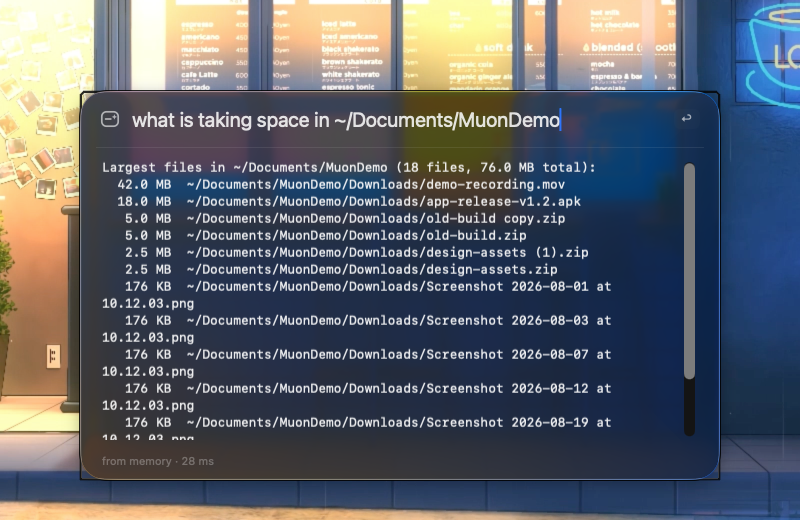
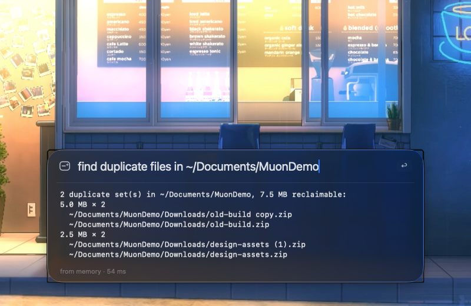
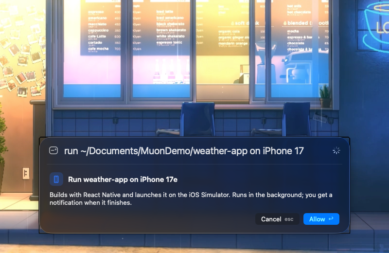
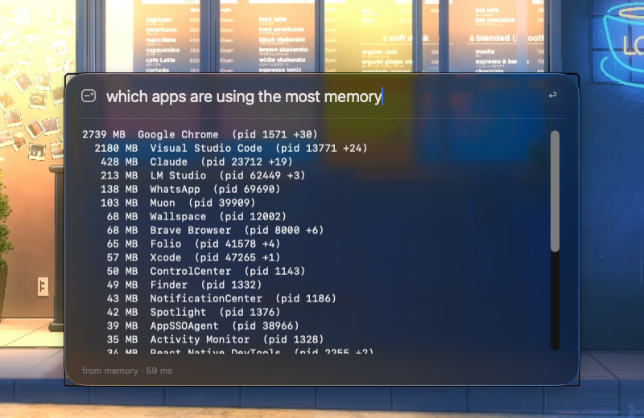
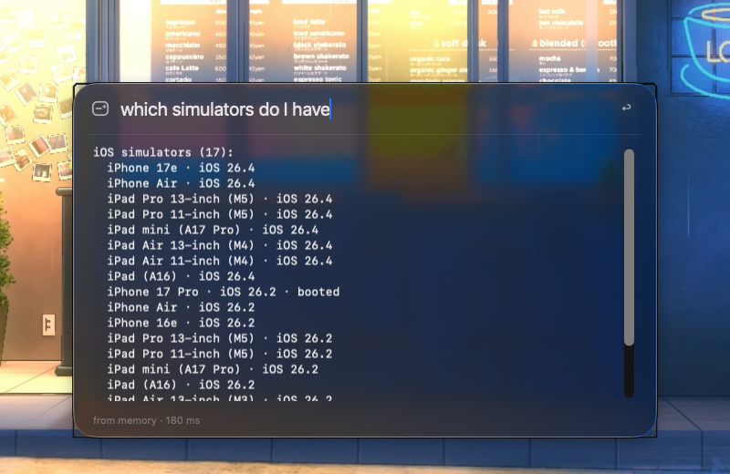

<div align="center">


# Muon

**A local AI agent for your Mac.** Press a key, say what you need, and Muon finds, cleans up, opens, builds and answers — on-device, with zero idle footprint.

[](LICENSE)


[](https://github.com/harshdvaid24/muon/releases/latest)
[](https://github.com/harshdvaid24/muon/releases)


<sub>Real recording of Muon on the reproducible demo workspace · [HD video](docs/media/demo.mp4)</sub>

**[⬇ Download for macOS](https://github.com/harshdvaid24/muon/releases/latest)** · `brew install --cask harshdvaid24/tap/muon` · **[Website](https://harshdvaid24.github.io/muon/)**

<sub>If Muon saves you time, a ⭐ helps other Mac users find it.</sub>

</div>

## What it does for you

| | |
|---|---|
| **Free up disk space** — *"what is taking space in ~/Downloads"* lists the biggest files, skipping `node_modules`, `Pods` and build folders. |  |
| **Find duplicates** — *"find duplicate files in ~/Downloads"* groups identical files and tells you how much space you'd get back. |  |
| **Sweep your code** — *"search code for TODO in ~/Projects/weather-app"* shows every hit with its line; press ↩ to open the file. |  |
| **Clean up safely** — *"move the screenshots in ~/Downloads into ~/Downloads/Archive"* lists the exact files and asks once. Deleting always means Trash. |  |
| **Build & run** — *"run ~/Projects/weather-app on iPhone 17"* builds your React Native app on the simulator in the background and notifies you when it's done. |  |
| **Find memory hogs** — *"which apps are using the most memory"* before your next build slows to a crawl. |  |
| **Know your devices** — *"which simulators do I have"* lists iOS simulators, Android emulators and plugged-in phones. |  |
| **Quick answers** — *"what is react native"* answers from the web without leaving your flow. |  |

**Try exactly what the video shows:** `scripts/demo-workspace.sh` creates a throwaway `~/Documents/MuonDemo` with a sample app, TODOs, big files, duplicates and screenshots.

## Everything you can ask

Muon understands plain language. These are examples, not a fixed syntax.

### Apps
| Ask | What happens |
|---|---|
| `open xcode` · `open safari` | Launches or focuses the app |
| `quit spotify` | Asks the app to quit (it can save first) — *asks you first* |
| `which apps are using the most memory` | Running apps sorted by RAM |
| `force quit <pid>` | Terminates a stuck process — *native confirmation dialog* |
| `in safari open a new private window` | Runs any app's menu command (Safari ▸ File ▸ New Private Window) — *asks first, needs Accessibility* |
| `what menus does notes have` | Lists an app's menu commands so you can drive it |

### Files and folders
| Ask | What happens |
|---|---|
| `find package.json in ~/Projects/weather-app` | Finds files by name |
| `find pdfs about invoices` | Spotlight search by content, kind or date |
| `show me ~/Projects/weather-app/README.md` | Reads a text file (first 20 KB) |
| `what is inside ~/Downloads` | Lists a folder |
| `reveal ~/Downloads/report.pdf in finder` | Shows it in Finder |
| `open ~/Documents/plan.pdf` | Opens with the default app (never runs apps or scripts) |
| `move the screenshots in ~/Downloads into ~/Downloads/Archive` | Exact file list, one confirmation |
| `archive the pdfs on my desktop` | Moves them into `Desktop/Archive` |
| `trash zips in downloads older than 30 days` | Moves matching files to the Trash |
| `rename`, `copy`, `create folder` | Available to the planner, each confirmed |

### Disk space
| Ask | What happens |
|---|---|
| `what is taking space in ~/Downloads` | Largest files |
| `find duplicate files in ~/Downloads` | Identical files and reclaimable space |
| `how much disk space is free` | Disk, RAM, CPU load, battery and thermal state |

### Projects and code
| Ask | What happens |
|---|---|
| `list my projects` | Projects in `~/Projects` and `~/Work` with their type |
| `open weather-app in vs code` · `open weather-app in xcode` | Opens the project in your editor |
| `search code for FirebaseApp.configure` | ripgrep across your projects |
| `search code for TODO in ~/Projects/weather-app` | Scoped to one folder |
| `how many react native projects do I have and which use firebase?` | Multi-step: the local model plans and runs several searches |

### Developer workflows
| Ask | What happens |
|---|---|
| `which simulators do I have` | iOS simulators, Android emulators, connected devices |
| `run ~/Projects/weather-app on iPhone 17` | Builds and launches a React Native app on the simulator — *background job* |
| `run weather-app on pixel 9` | Boots the Android emulator and runs the app — *background job* |
| `job status` · `is my build done` | Progress and logs of background builds; a notification arrives when each finishes |
| `list the workflows in weather-app` | GitHub Actions workflows (via `gh`) |
| `trigger the release workflow in weather-app on main` | Starts a workflow run — *native confirmation dialog, since releases are hard to undo* |
| `show recent workflow runs in weather-app` | Status, result and link for recent runs |

### Web and chat
| Ask | What happens |
|---|---|
| `what is typescript` · `search the web for swift concurrency` | A short answer with its source |
| `open github.com` | Opens it in your browser |
| `hi` · `what can you do` | A one-line conversational reply, on-device |

### Learning and shortcuts
| Ask | What happens |
|---|---|
| *(repeat any request)* | Answered from local memory in milliseconds, with no model at all |
| `save macro morning` | Saves your last multi-step actions; type `morning` to replay |
| `agent: <anything>` | Forces the larger local model for a hard request |

### Ways in
| Where | How |
|---|---|
| Keyboard | `⇧⌥Space` opens the palette — or record any shortcut in **Settings › Shortcut › Record** |
| Menu bar | Click the icon; right-click for model status, macros and Settings |
| Spotlight, Shortcuts, Siri | **Ask Muon**, **Open Project**, **Run Macro** |
| Scripts, Raycast | `open "muon://ask?q=what%20is%20taking%20space%20in%20~/Downloads"` |
| Terminal | `Muon.app/Contents/MacOS/Muon --query "…" [--yes] [--tier 2]` |

## How it works

```
  ⇧⌥Space ──▶ Liquid Glass palette
                    │
      ┌─────────────┼───────────────────────────┐
      ▼             ▼                           ▼
   Tier 0        Tier 1                      Tier 2
   memory        Apple on-device model       LM Studio (MLX), on demand
   0 ms          ~1 s, no app memory         only when the Mac can spare it,
                 single steps + chat         unloads after 5 min
      └─────────────┴─────────────┬─────────────┘
                                  ▼
                 mac-tools · TypeScript MCP server
                 typed tools · path policy · audit log
                 starts on demand, exits after 5 min idle
                                  ▼
          files · apps · menus · disk · simulators · GitHub · web
```

Common, well-defined requests (open, find, largest files, duplicates, code search, cleanup) are handled by the on-device tier or by deterministic parsers — fast and predictable. The local LLM only plans genuinely multi-step work.

## Install

Requirements: macOS 26 on Apple Silicon with Apple Intelligence on, and Node.js 20+ (`brew install node`). Optional: [LM Studio](https://lmstudio.ai) for multi-step planning, `gh` for GitHub Actions, Android SDK for emulators, `ripgrep` for faster code search.

**Download (easiest)**
1. Download **[Muon.zip](https://github.com/harshdvaid24/muon/releases/latest)** and move `Muon.app` to Applications.
2. Open it. Muon is not notarized yet, so macOS may block it the first time: open System Settings › Privacy & Security and click **Open Anyway** (or run `xattr -dr com.apple.quarantine /Applications/Muon.app`).
3. Press `⇧⌥Space`. Check your setup any time with `/Applications/Muon.app/Contents/MacOS/Muon --diagnose`.

**Homebrew**

```bash
brew install --cask harshdvaid24/tap/muon
```

**From source** (Xcode 26)

```bash
git clone https://github.com/harshdvaid24/muon.git && cd muon
cd mac-tools && npm install && npm run build && cd ..
scripts/build.sh && scripts/run.sh
```

Multi-step planning (optional, one time):

```bash
lms get qwen/qwen3.5-9b@4bit --mlx -y    # main model (~6 GB)
lms get qwen/qwen3.5-4b@4bit --mlx -y    # low-memory fallback (~3 GB)
```

Then right-click the menu bar icon → **Settings**: record your shortcut (default `⇧⌥Space`), review allowed folders, and grant **Accessibility** if you want menu commands in other apps.

> **Shortcut does nothing?** Another app may own that combination. Open Settings › Shortcut › **Record** and press a different one — Muon registers exactly what your keyboard sends. Clicking the menu bar icon always works.

## Safety model

- **No shell.** Every capability is a typed tool running an allowlisted binary with argument arrays — never a command string. Background jobs have their own short allowlist.
- **Path policy.** Paths are normalized and symlink-resolved, must live in an allowed folder (`~/Projects ~/Work ~/Downloads ~/Documents ~/Desktop` by default), and protected locations (`~/Library`, `~/.ssh`, `/System`, …) are always refused. Symlinks, allowed roots themselves, and moving a folder into itself are refused for changes.
- **You approve changes.** Reading runs freely. Moving, copying, renaming, trashing, quitting apps, menu commands and simulator builds ask first, with "Always allow in this folder". Force-quit and GitHub workflow triggers use a native confirmation dialog.
- **Delete means Trash.** Nothing is ever permanently deleted.
- **Opening never executes.** `open` refuses apps, scripts and executables.
- **Network is one tool.** Only `webSearch` / `openInBrowser` go online (and `gh` for GitHub, when you ask).
- **Audit log** of every tool call (paths only, never contents) at `~/Library/Application Support/Muon/audit.jsonl`, kept 30 days.
- **Machine protection.** The larger model loads only when memory, thermal state, battery and running builds allow it.

## Learning, without the bloat

A capped SQLite store (`memory.db`) keeps an intent cache, project aliases, app and folder frecency, and macros — 300 rows per table, 14-day half-life, pruned at launch. No fine-tuning, no embeddings, no background indexing. The more you use Muon, the more requests skip the model entirely.

## Use the tools from other apps

`mac-tools` is a standard MCP server, so any MCP client can use the same safe tools:

```bash
claude mcp add mac-tools -- node /path/to/muon/mac-tools/dist/index.js
```

Tools: `searchFiles` `findFiles` `searchCode` `readFile` `listDirectory` `listProjects` `matchFiles` `largestFiles` `findDuplicates` `openApplication` `openPath` `revealInFinder` `moveItems` `copyItems` `renameItem` `createFolder` `trashItems` `quitApplication` `killProcess` `listRunningApps` `getSystemStats` `listMenus` `runMenuCommand` `listDevices` `runOnDevice` `jobStatus` `listWorkflows` `workflowRuns` `triggerWorkflow` `webSearch` `openInBrowser`

## Development

```bash
cd mac-tools && npm test     # tool server
scripts/build.sh test        # app
scripts/demo-workspace.sh    # sample workspace for manual testing
```

Design notes: [`docs/superpowers`](docs/superpowers) · Contributing: [CONTRIBUTING.md](CONTRIBUTING.md)

## Known limitations

- Run-on-device supports React Native projects; for native Xcode projects, Muon opens the workspace so you can press Run.
- Android runs need an emulator created in Android Studio (or a connected phone).
- LM Studio ignores `--context-length` for these MLX models; set a cap in LM Studio's model settings if you want one.
- CI tests the tool server; the macOS 26 app is built locally.

## License

[MIT](LICENSE) © 2026 Harsh Vaid
