<div align="center">


# Muon

**Your Mac's local AI, one keystroke away.** Fix your writing, explain errors, read documents and screenshots, turn recordings into meeting notes and receipts into expenses. On-device, private, free.

[](LICENSE)


[](https://github.com/harshdvaid24/muon/releases/latest)
[](https://github.com/harshdvaid24/muon/releases)


<sub>Real recording on the reproducible demo workspace · [HD video](docs/media/demo.mp4)</sub>

**[⬇ Download for macOS](https://github.com/harshdvaid24/muon/releases/latest)** · `brew install --cask harshdvaid24/tap/muon` · **[Website](https://harshdvaid24.github.io/muon/)**

<sub>If Muon saves you time, a ⭐ helps other Mac users find it.</sub>

</div>

Press `⇧⌥Space` and say what you need. Muon uses Apple's on-device model for the everyday things people open a chatbot for, and typed tools for the things they do by hand. It is a menu bar app with no background process and no idle load. Nothing leaves your Mac unless you ask for a web page.

Type it, or press `⌘⇧M` and say it. Drop a file on the palette, press `⌘O`, or `⌘V` a copied image or file, then ask about it. Type `what can you do` for the full catalog inside the app.

## What it does for you

| | |
|---|---|
| **Fix your writing.** Copy text in any app, then ask *"make this professional"*, *"fix grammar"*, *"shorten"* or *"reply saying I'll be there at 5"*. The result has **Copy** and **Paste** buttons. Paste puts it straight back into the app you came from. About one second, on-device. | 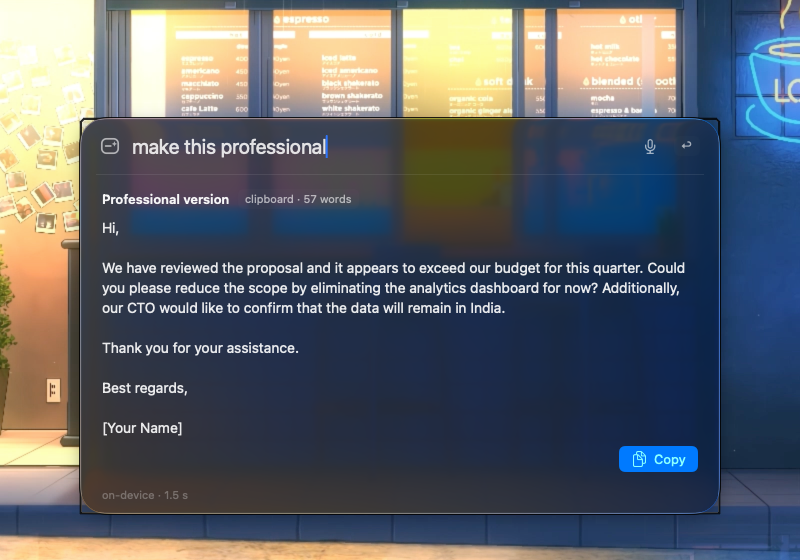 |
| **Explain errors and code.** Copy an error, a stack trace, a block of code or some jargon and ask *"explain this"*. Muon says what it means and what to do about it. | 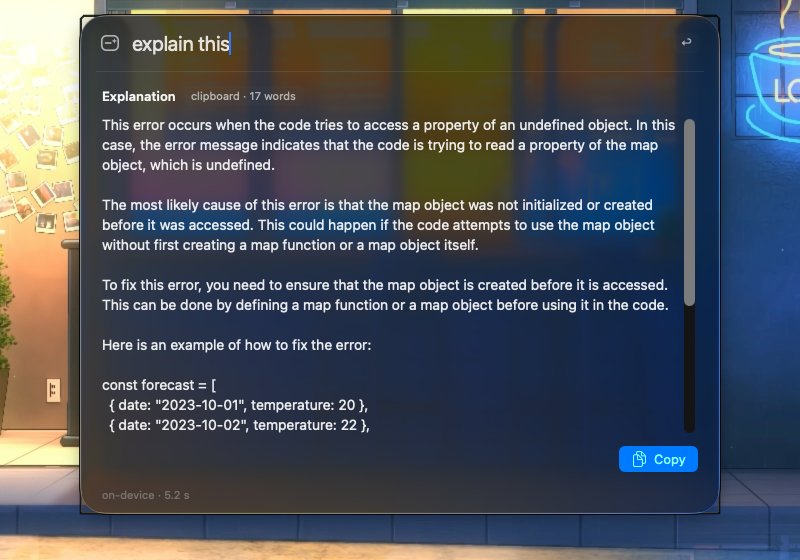 |
| **Ask your documents.** Drop a file on the palette, press `⌘O` or the paperclip, or `⌘V` a copied file, then ask *"who pays the deposit and how much"*. Or just name it: *"analyse statement.pdf from downloads and give me a brief"*. Typed paths work too: *"what does ~/Documents/lease.pdf say about the deposit"*. PDF, .docx, .txt, .md, .csv, .json and images. Scanned PDFs are read with on-device OCR. | 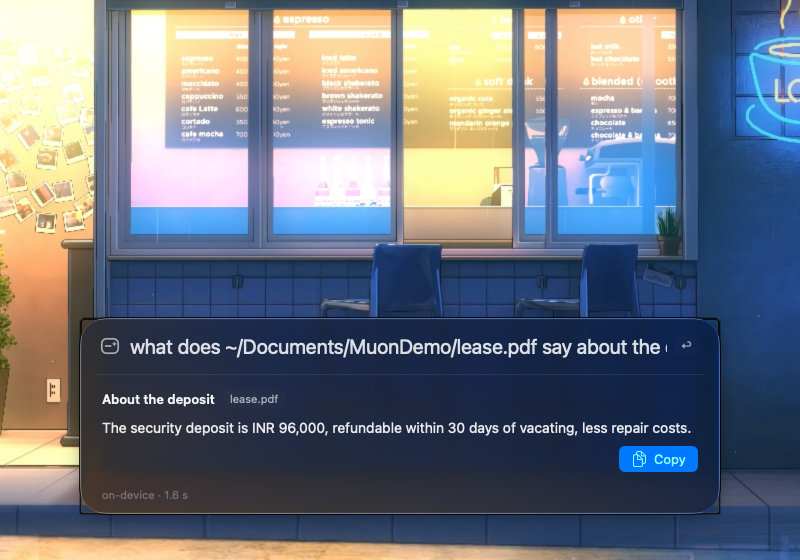 |
| **Read screenshots.** `⌘V` a copied screenshot (or any image) and ask *"explain this"*: on-device OCR plus an explanation. Also *"explain the error in this screenshot"* for your newest one, *"read the latest screenshot"*, and *"rename my screenshots"* by what they show. | 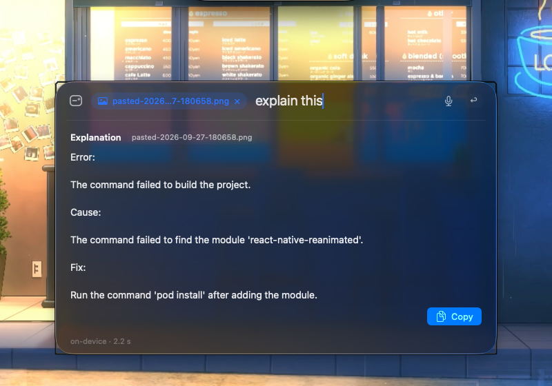 |
| **Meeting notes from a recording.** *"meeting notes from ~/Downloads/standup.mp4"* transcribes on-device and returns a summary, the decisions and the action items. Audio and video files. | 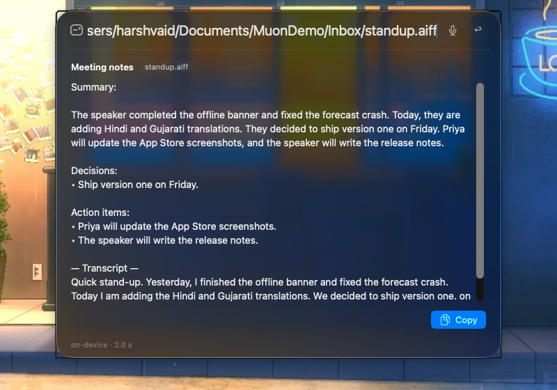 |
| **Receipts into expenses.** *"total the receipts in ~/Documents/Receipts"* reads each receipt photo, lists merchant, date and total, adds them up, and saves a CSV after one confirmation. | 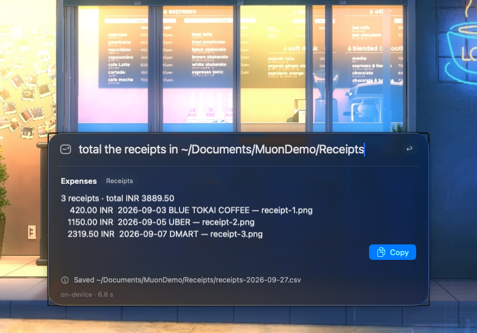 |
| **Developer chores.** *"search code for TODO in ~/Projects/weather-app"* shows every hit; press ↩ to open it. Also *"run weather-app on iPhone 17"*, *"commit this"*, *"clean the metro caches"* and *"why did my app crash"*. | 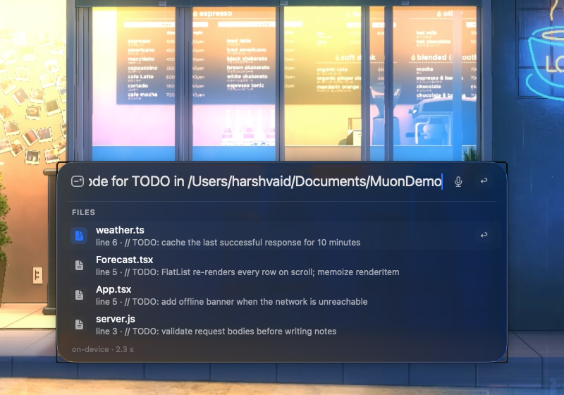 |
| **Files, disk and apps.** *"move the screenshots in ~/Downloads into ~/Downloads/Archive"* lists the exact files and asks once. Delete always means Trash. Also largest files, duplicates, memory hogs and menu commands in any app. | 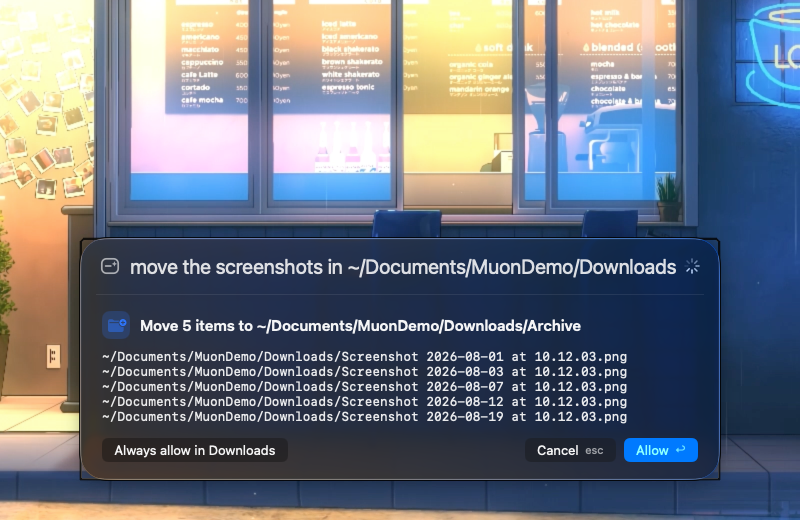 |
| **Just say it.** Press `⌘⇧M` or click the mic, say what you need and pause. Live on-device transcription fills the field and the request runs. Spoken requests can get spoken replies (Settings › Voice). | 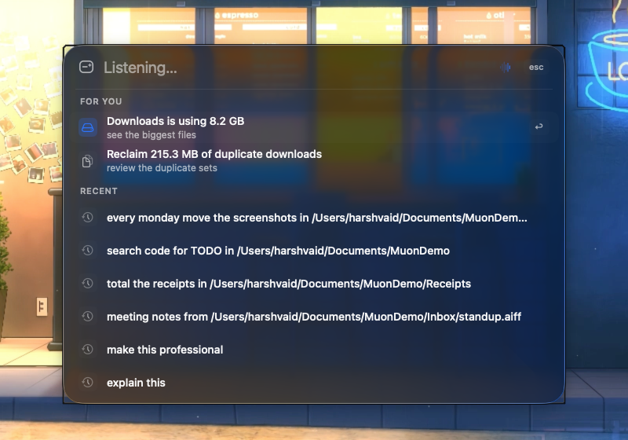 |
| **Ask what it can do.** *"what can you do"* shows the whole catalog inside the app, instantly, without a model. | 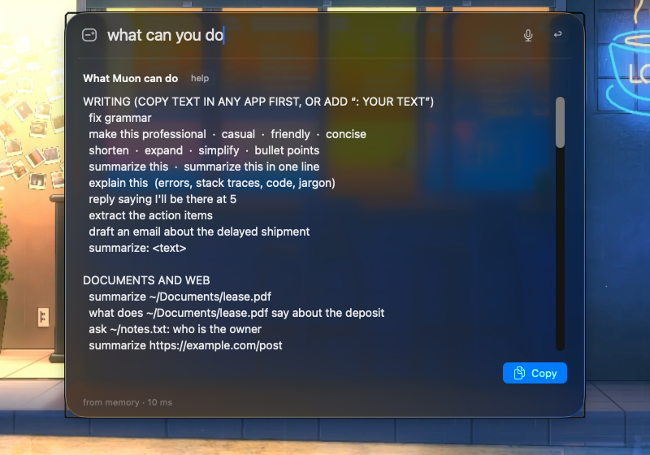 |

**Try it yourself:** `scripts/demo-workspace.sh` creates a throwaway `~/Documents/MuonDemo` with a sample app, an error screenshot, a scanned lease PDF, three receipt photos, an inbox with a client email and an error log, and a spoken standup clip.

## It gets smarter, not heavier

Muon has no indexer and no background job. It learns from what you do with it.

| | |
|---|---|
| **For you.** Open the empty palette and Muon suggests what is worth doing: old screenshots to archive, how big Downloads has grown, duplicate space to reclaim, a recent crash to explain. If an error is on your clipboard it offers to explain it; a URL, to summarize it; long text, to summarize it. Computed at most once a day, only when you open the palette. |  |
| **Rules.** A cleanup you have run three times is offered as a weekly rule. Or ask directly: *"every monday move the screenshots in ~/Downloads older than 30 days into ~/Downloads/Archive"*. Rules run on wake or launch with a notification. *"undo"* reverses the last automated move or rename. Managed in Settings. | 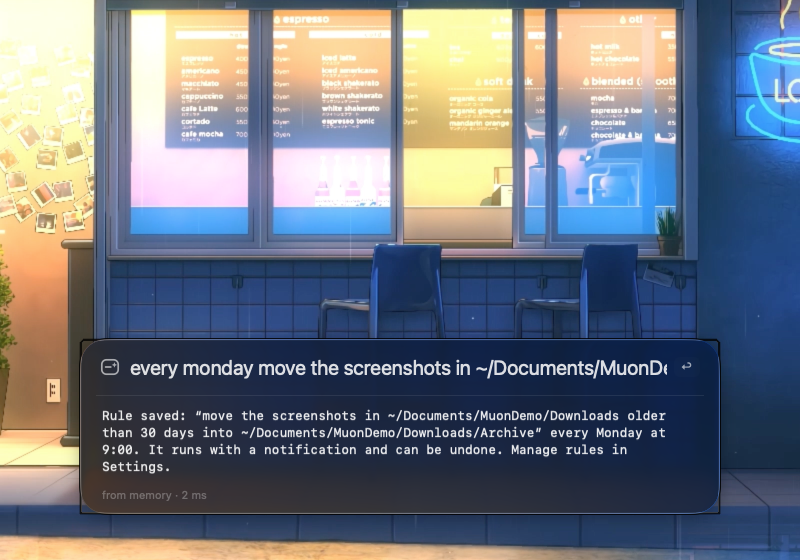 |
| **Recent.** Your recent requests sit under the suggestions, most used first. `↑` `↓` walk them, `⇥` puts one in the field to edit, `↩` runs it. With something typed, `↑` `↓` cycle through recent requests like a shell. | 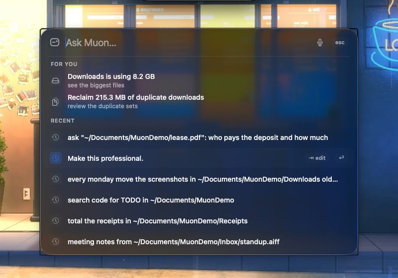 |

**Memory.** Repeated requests are answered from a capped local cache in milliseconds, with no model at all. Muon learns your project aliases. `save macro <name>` replays a multi-step action by name.

## Why Muon

Compared with the local AI agents people actually run on a Mac, from each project's own README on 28 September 2026. Muon is the newest and by far the smallest project here; the point is what it is built to be.

| | **Muon** | OpenClaw (391k★, MIT) | goose (54.7k★, Apache-2.0) | Open Interpreter (68.5k★, Apache-2.0) | AnythingLLM (66.5k★) · Jan (44.7k★) |
|---|---|---|---|---|---|
| What it is | Menu bar agent for everyday Mac work: writing, documents, screenshots, voice, files, apps, dev chores | Personal assistant that connects to your messaging apps, with a persistent Gateway daemon | General-purpose agent, desktop app + CLI, 70+ MCP extensions, part of the Linux Foundation | Coding agent (forked from OpenAI's Codex), optimized for low-cost models | Private chat and RAG apps with local models; Jan adds MCP |
| How the model changes things | **Never a shell.** 56 typed tools, allowlisted binaries with argument arrays, path policy, one card per change, Trash not delete | "Tools run on the host for the main session unless you configure sandboxing"; security guides and exposure runbooks published | Shell and file access through its developer extension and MCP servers; approval configurable | Runs commands inside native sandboxing, with approvals | They do not act on the Mac; chat, documents, web skills |
| Everyday ask, end to end | **1–3 s on Apple's on-device model**; repeats in milliseconds | Model turns via the provider you pick | Model turns via the provider you pick | Model turns via the provider you pick | Local model chat, seconds to tens of seconds |
| Idle cost | **56 MB app, no model loaded, no daemon** | Gateway daemon always on | Desktop app | CLI process while running | Model loaded while the app is open |
| Needs a big model | **No.** Apple's on-device model + typed tools do the everyday work; a local LLM only for multi-step plans, images and very long text | Hosted or local providers | 15+ providers incl. Ollama | OpenAI-compatible providers | Yes, local |
| Your text, documents, recordings | **Stay on the Mac** (only `webSearch`, `readWebPage`, `openInBrowser` go online, when you ask) | Depends on the provider | Depends on the provider | Depends on the provider | Stay on the Mac |
| Learns from you | Memory, aliases, rules, For you, recent requests; capped, on-device | Sessions, memory | Sessions | Sessions | Chat history |
| UI | Native Liquid Glass palette, voice, drop, Open With, Finder | Chat apps you already use | Desktop app, CLI | Terminal | Desktop app |
| Install | Download or `brew install --cask`, ad-hoc signed | `curl … | bash` or npm | Desktop app or CLI script | `curl … | sh` | Download |

**Where Muon is best**

- **Everyday asks without a big model.** Rewrite this, explain that error, what does this PDF say, read this screenshot, meeting notes from this recording, total these receipts: 1–9 s on the built-in model, measured below, with nothing downloaded and nothing loaded at idle.
- **Acting on the Mac safely.** The model never gets a shell. Every capability is a typed tool; every change is a card you approve; delete means Trash; paths outside your folders are refused. The whole model-facing surface is 8,200 lines you can read, with 150 tests.
- **Zero idle cost.** 56 MB in the menu bar, no daemon, no model in memory. The tool server starts on demand and exits after five minutes.
- **It gets smarter, not heavier.** Repeats come from memory; cleanups you repeat become rules; the empty palette suggests what is worth doing.

**Where it is not.** Muon is not an autonomous agent for hour-long tasks, does not chat with you over WhatsApp, and needs macOS 26 on Apple Silicon with Apple Intelligence. For a coding session it hands you to Claude Code, Codex, Gemini CLI or Aider in a VS Code window rather than pretending to be one.

**Measured on a MacBook Air M4, 24 GB, macOS 26** (Muon's own footer shows these on every answer):

| Request | Time | Where |
|---|---|---|
| Rewrite an email in a professional tone | 1.3–2.6 s | on-device |
| Explain a copied error or stack trace | 2–9 s | on-device |
| Text of a screenshot | 0.7 s | on-device OCR |
| Question about a scanned lease PDF | 1.5–3 s | on-device OCR + model |
| Meeting notes from a 20 s recording | 2.3 s | on-device transcription + model |
| Three receipt photos to a CSV | 3–7 s | on-device |
| Largest transaction in a bank statement, exact | 8.6 s | computed from the text + on-device |
| Which simulators do I have, open Xcode, biggest files | 0.3–2 s | on-device routing, typed tool |
| Any request you have made before | under 0.3 s | memory, no model |

**Why it is fast.** Most requests never reach a model: writing, documents, screenshots, cleanups, rules, file names and help are parsed deterministically, and anything you have asked before is answered from a capped local cache. What is left goes to Apple's on-device model with guided generation into a typed command, so there is no JSON to parse and nothing to hallucinate. Only multi-step plans, image understanding and very long text go to a bigger local model, and only when memory, thermal state and battery allow.

**Why it is safe.** The model never gets a shell. It can only call tools that take typed arguments, run allowlisted binaries with argument arrays, refuse paths outside your allowed folders, and put every change behind a card you approve. Delete means Trash. The whole model-facing surface is 8,200 lines of Swift and TypeScript you can read, with 150 tests. Details in [Private by design](#private-by-design).

## Everything you can ask

Muon understands plain language. These are examples. There is no fixed syntax.

### Writing

Copy text in any app, then ask. Every result has **Copy** and **Paste**. Paste goes straight into the app you came from when Accessibility is granted.

| Ask | What happens |
|---|---|
| `fix grammar` | Corrects grammar and spelling, keeps your wording |
| `make this professional` | Rewrites in a tone: formal, casual, friendly, polite, confident, concise, clear or simple |
| `shorten` · `expand` · `simplify` · `bullet points` | Rewrites the clipboard text that way |
| `summarize this` · `summarize this in one line` · `as bullets` · `in detail` | A summary at the length you ask for |
| `explain this` | Explains an error, stack trace, code or jargon |
| `reply saying I'll be there at 5` | Drafts a reply to the message on your clipboard |
| `extract the action items` | Also dates, amounts, emails, names, links and key points |
| `draft an email about the delayed shipment` | Writes an email from scratch |
| `summarize: <text>` | Inline form, no clipboard needed |
| *(drop a file, `⌘O`, or `⌘V` a copied file, then)* `fix grammar` · `who is the tenant` | Runs the request on the attached file |

On-device, about one second. Long text goes to the local LM Studio model automatically, or is processed in parts.

### Documents and web
| Ask | What happens |
|---|---|
| `analyse statement.pdf from downloads and give me a brief` | A file name is enough: Muon finds it in the folder you name (or Downloads, Documents, Desktop), reads it, and answers. Also `check invoice.pdf in documents: what is the total` |
| `summarize ~/Documents/lease.pdf` | Summary of a PDF, .docx, .txt, .md, .csv, .json or image |
| `what does ~/Documents/lease.pdf say about the deposit` | Answers from the document |
| `ask ~/notes.txt: who is the owner` | Same, inline form |
| `summarize https://example.com/post` | One read-only fetch, only when you ask |
| `what does https://example.com/pricing say about the free plan` | Answers from the page |
| `what is typescript` · `search the web for swift concurrency` | A short answer with its source |
| `open github.com` | Opens it in your browser |

PDFs that contain only scanned pages are read with on-device OCR.

### Screenshots and images
| Ask | What happens |
|---|---|
| `read the latest screenshot` | Text from your newest screenshot, on-device OCR |
| `copy text from ~/Desktop/shot.png` | OCR to the clipboard |
| `explain the error in this screenshot` | OCR plus explanation. No LM Studio needed |
| `describe ~/Desktop/a.png: which app is this` | Image understanding via the local vision model in LM Studio |
| `compare ~/Desktop/actual.png with ~/Designs/expected.png` | Lists the visual differences |
| `rename my screenshots` | Names by content, for example `2026-09-27-xcode-build-error-reanimated.png`. One confirmation |
| *(`⌘V` a copied image, then)* `explain this` · `which app is this` | Works on the pasted image |

Settings › Automation › **Name new screenshots by their content** names each screenshot as it lands. `undo` reverts the last one.

### Voice
| Ask | What happens |
|---|---|
| `⌘⇧M`, then speak | Live on-device transcription into the field; the request runs when you pause. Spoken requests get spoken replies (Settings › Voice) |
| `transcribe ~/Downloads/call.m4a` | Transcript, on-device SpeechAnalyzer |
| `meeting notes from ~/Downloads/standup.mp4` | Summary, decisions and action items. Audio and video files |

### Expenses
| Ask | What happens |
|---|---|
| `total the receipts in ~/Documents/Receipts` | Merchant, date, total and currency per receipt, the sum, and a CSV saved after one confirmation |

### Crashes
| Ask | What happens |
|---|---|
| `why did my app crash` · `why did Safari crash` | Reads crash reports from the last 48 hours and explains the crashed thread and likely cause |

Crash reports are read from `~/Library/Logs/DiagnosticReports` only, read-only. This is the one exception to the path policy below.

### Developer
| Ask | What happens |
|---|---|
| `start claude code for weather-app` · `start agent for weather-app` · `open codex in weather-app` | A VS Code window for that project that is just the assistant: Claude Code (or Codex, Gemini CLI, Aider) fills the window, no side bars, tabs or start page. Muon writes `<project>/.muon/<name>.code-workspace` (git-excluded locally) with a terminal profile that runs the assistant. Already open? It is brought to the front |
| `run ~/Projects/weather-app on iPhone 17` · `run weather-app on pixel 9` | Builds and launches a React Native app. Background job, notification when done |
| `which simulators do I have` | iOS simulators, Android emulators and connected devices |
| `is my build done` · `job status` | Progress and logs of background builds |
| `what changed` · `commit this` · `push` | git status, diff, commit with your message, push. Never force, never amend. Commit and push ask first |
| `clean the metro caches` | Frees ports 8081 and 8097, resets watchman, clears the Metro and haste caches |
| `pair my watch 192.168.1.20:41234 code 123456` · `connect 192.168.1.20:41234` | Wireless adb pairing and connection |
| `install ~/Downloads/app.apk on my phone` | Installs on the connected device |
| `build a signed apk for weather-app` | Android release build |
| `list the workflows in weather-app` · `show recent workflow runs in weather-app` | GitHub Actions, via `gh` |
| `trigger the release workflow in weather-app on main` | Starts a run. Native confirmation dialog |
| `search code for TODO in ~/Projects/weather-app` | Every hit with its line. Press ↩ to open it |
| `open weather-app in vs code` · `open weather-app in xcode` | Opens the project in your editor |
| `list my projects` | Projects in `~/Projects` and `~/Work` with their type |

### Files, disk and apps
| Ask | What happens |
|---|---|
| `what is taking space in ~/Downloads` | Largest files, skipping `node_modules`, `Pods` and build folders |
| `find duplicate files in ~/Downloads` | Identical files and the space you would get back |
| `how much disk space is free` | Disk, RAM, CPU load, battery and thermal state |
| `move the screenshots in ~/Downloads into ~/Downloads/Archive` | Exact file list, one confirmation |
| `trash zips in downloads older than 30 days` | Moves matching files to the Trash |
| `archive the pdfs on my desktop` | Moves them into `Desktop/Archive` |
| `find pdfs about invoices` | Spotlight search by content, kind or date |
| `find package.json in ~/Projects/weather-app` | Finds files by name |
| `what is inside ~/Downloads` · `reveal ~/Downloads/report.pdf in finder` | Lists a folder, shows a file in Finder |
| `open xcode` · `quit spotify` | Launches an app, or asks it to quit. Quit asks you first |
| `which apps are using the most memory` | Running apps sorted by RAM |
| `in safari open a new private window` | Runs any app's menu command. Asks first, needs Accessibility |
| `what menus does notes have` | Lists an app's menu commands |

### Automation and memory
| Ask | What happens |
|---|---|
| *(open the empty palette)* | **For you** rows: screenshots to archive, Downloads size, duplicate space, recent crashes, clipboard triage, and a cleanup you have run three times offered as a weekly rule |
| `every monday move the screenshots in ~/Downloads older than 30 days into ~/Downloads/Archive` | Saved as a rule. Only deterministic cleanups can become rules. Runs on wake or launch with a notification |
| `undo` | Reverses the last automated move or rename |
| *(repeat any request)* | Answered from local memory in milliseconds, no model |
| `save macro morning` | Saves your last multi-step actions. Type `morning` to replay |
| `what can you do` · `help` | The full catalog, inside the app, no model |

### Ways in
| Where | How |
|---|---|
| Keyboard | `⇧⌥Space` opens the palette. Record any shortcut in **Settings › Shortcut › Record**. Inside: `↑` `↓` suggestions and recent requests, `⇥` edit, `⌘O` attach, `⌘V` paste an image or file, `⌘⇧M` talk |
| Voice | `⌘⇧M` or the mic button, the menu bar's **Talk to Muon**, or `open muon://listen`. **Settings › Voice** can start listening whenever the palette opens |
| Files | Drop a file or folder on the palette, press `⌘O` or the paperclip, or right-click any file in Finder › **Open With › Muon**. Pasted images are kept under `~/Library/Application Support/Muon/Pasted` (newest 20) |
| Menu bar | Click the icon. Right-click for model status, macros and Settings |
| Spotlight, Shortcuts, Siri | App Intents: **Ask Muon**, **Open Project**, **Run Macro** |
| Scripts, Raycast | `open "muon://ask?q=fix%20grammar"` |
| Terminal | `Muon.app/Contents/MacOS/Muon --query "…" [--yes] [--tier 2]` runs headless. `--diagnose` checks your setup. `--suggest` prints the For you rows |

## How it works

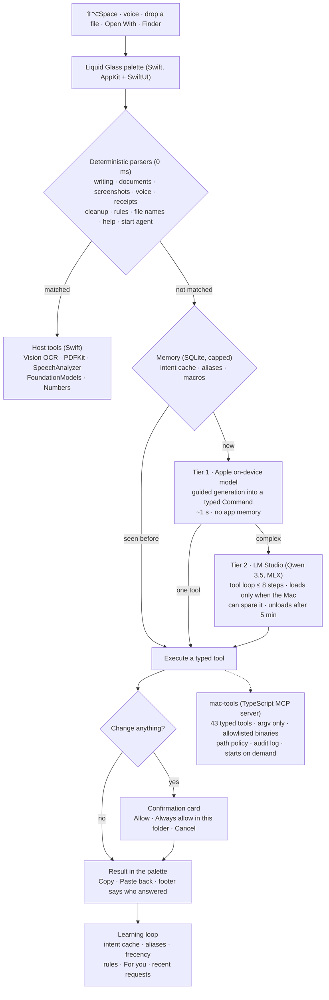

Tier 0 is a capped local cache. Tier 1 is Apple's on-device model: single steps, chat, and all writing and explaining. Tier 2 is LM Studio, used only for multi-step planning, image understanding and very long text. It loads only when memory, thermal state and battery allow, and unloads after five minutes. Everything works without LM Studio and without Laya; those two only add power.

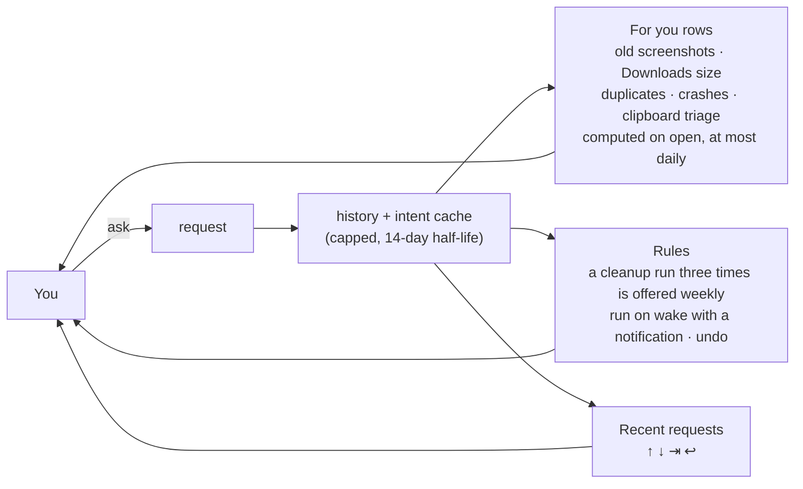

## Private by design

- **No shell, ever.** Every capability is a typed tool running an allowlisted binary with an argument array. Never a command string.
- **Path policy.** Paths are normalized and symlink-resolved and must live in an allowed folder (`~/Projects ~/Work ~/Downloads ~/Documents ~/Desktop` by default). `~/Library`, `~/.ssh`, `/System` and other protected locations are always refused. Symlinks and the allowed roots themselves are refused for changes. One documented exception: crash reports are read from `~/Library/Logs/DiagnosticReports`, read-only.
- **Every change asks first.** Moves, renames, trash, quitting apps, menu commands, builds, git commit and push, and saving files all ask, with "Always allow in this folder". Force-quit and GitHub workflow triggers use a native dialog.
- **Delete means Trash.** Nothing is ever permanently deleted.
- **Opening never executes.** `open` refuses apps, scripts and executables.
- **The internet is a few named tools.** Only `webSearch`, `readWebPage` and `openInBrowser` go online (and `gh` when you ask). Your text, documents, screenshots and recordings stay on the Mac.
- **Audit log** of every tool call at `~/Library/Application Support/Muon/audit.jsonl`. Paths only, never contents, kept 30 days.
- **Machine protection.** The larger model loads only when memory, thermal state, battery and running builds allow it.

## Install

Requirements: macOS 26 on Apple Silicon with Apple Intelligence on, and Node.js 20+ (`brew install node`). Optional: [LM Studio](https://lmstudio.ai) for multi-step planning and images, `gh` for GitHub Actions, Android SDK for emulators, `ripgrep` for faster code search.

**Download (easiest)**
1. Download **[Muon.zip](https://github.com/harshdvaid24/muon/releases/latest)** and move `Muon.app` to Applications.
2. Open it. Muon is not notarized yet, so macOS may block it the first time: open System Settings › Privacy & Security and click **Open Anyway** (or run `xattr -dr com.apple.quarantine /Applications/Muon.app`).
3. Press `⇧⌥Space`. Check your setup any time with `/Applications/Muon.app/Contents/MacOS/Muon --diagnose`.

**Homebrew**

```bash
brew install --cask harshdvaid24/tap/muon
```

**From source** (Xcode 26)

```bash
git clone https://github.com/harshdvaid24/muon.git && cd muon
cd mac-tools && npm install && npm run build && cd ..
scripts/build.sh && scripts/run.sh
```

Then right-click the menu bar icon and open **Settings**: record your shortcut (default `⇧⌥Space`), review allowed folders, and grant **Accessibility** if you want Paste into other apps and menu commands.

> **Shortcut does nothing?** Another app may own that combination. Open Settings › Shortcut › **Record** and press a different one. Muon registers exactly what your keyboard sends. Clicking the menu bar icon always works.

## Optional backends

**LM Studio** adds multi-step planning, image understanding and very long text. One time:

```bash
lms get qwen/qwen3.5-9b@4bit --mlx -y    # main model (~6 GB)
lms get qwen/qwen3.5-4b@4bit --mlx -y    # low-memory fallback (~3 GB)
```

Muon loads the model only when memory, thermal state and battery allow, and unloads it after five minutes idle.

**Laya** ([github.com/NandhaKishorM/laya](https://github.com/NandhaKishorM/laya)) adds ~150 ms typed routing hints and language detection, so you can type requests in 100+ languages (non-English input needs LM Studio).

```bash
pip install "laya[serve]"
LAYA_PORT=8765 laya-serve
```

Then turn on **Settings › Laya**. Everything works without both; they only add power.


### Needle (experimental)

[Needle 3](https://github.com/cactus-compute/needle) is a 121M-parameter, 2-bit (29 MB) tool-calling model. Muon can ask it first for simple, non-destructive requests: about **50 ms** per decision against **~1.2 s** for the on-device model. Measured on Muon's own routing tools it was often wrong at full confidence (see the table), so it is off by default, acts only when at least 90% sure, never on tools that move or delete files, and the palette footer always says who answered.

<p>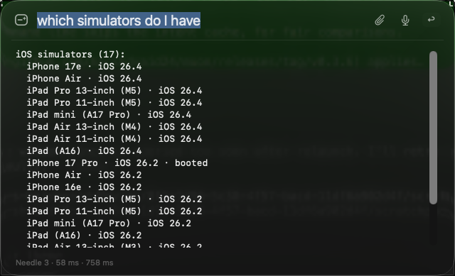 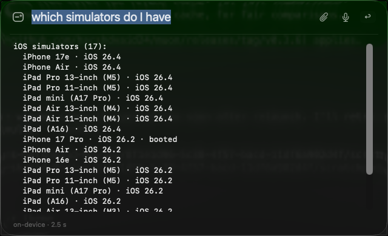</p>

Seventeen everyday requests, end to end from the command line, cache bypassed: on-device **16/17 right, median 1.9 s**; Needle first **8/17 right, median 0.6 s** (of the 14 it decided itself, 6 right, decision median 50 ms; 2 it handed back at low confidence were then answered right on-device). Turn it on in **Settings › Needle** to see it yourself; a fine-tune on your own requests is what would make it useful.

```bash
python3 -m venv ~/.muon/needle && ~/.muon/needle/bin/pip install cactus-needle
~/.muon/needle/bin/python scripts/needle-serve.py     # 127.0.0.1:8766, nothing leaves the Mac
MUON_NO_CACHE=1 Muon.app/Contents/MacOS/Muon --query "is my mac hot"   # prints via=Needle 3 · NN ms when Needle answered
```

**Fine-tune it on your own requests.** Needle learns your tools from examples (LoRA on the frozen base, merged into a `.cact`). Muon ships the pipeline: the tool schemas come from the tool server, the examples come from templates plus the routes Muon has already learned from you, and requests you list in `held_out.txt` never enter training so you can measure honestly.

```bash
~/.muon/needle/bin/pip install "cactus-needle[train]"                     # JAX, once
node scripts/needle-tools.mjs > tools.json                                 # Muon's tool schemas
~/.muon/needle/bin/python scripts/needle-data.py tools.json               # train.jsonl + val.jsonl
~/.muon/needle/bin/needle finetune train.jsonl --epochs 2 --batch-size 8 --max-len 2048 --out muon_lora.safetensors
~/.muon/needle/bin/needle build checkpoints/needle3.safetensors --lora muon_lora.safetensors --out muon.cact
NEEDLE_WEIGHTS=muon.cact ~/.muon/needle/bin/python scripts/needle-serve.py
```


## Use the tools from other apps

`mac-tools` is a standard MCP server, so any MCP client can use the same safe tools:

```bash
claude mcp add mac-tools -- node /path/to/muon/mac-tools/dist/index.js
```

Tools: `searchFiles` `findFiles` `searchCode` `readFile` `listDirectory` `listProjects` `matchFiles` `largestFiles` `findDuplicates` `openApplication` `openPath` `revealInFinder` `moveItems` `copyItems` `renameItem` `createFolder` `trashItems` `writeTextFile` `quitApplication` `killProcess` `listRunningApps` `getSystemStats` `listMenus` `runMenuCommand` `listDevices` `runOnDevice` `jobStatus` `listWorkflows` `workflowRuns` `triggerWorkflow` `readWebPage` `gitStatus` `gitDiff` `gitCommit` `gitPush` `cleanDevCaches` `adbPair` `adbConnect` `installApp` `buildAndroidRelease` `webSearch` `openInBrowser`

The app adds in-process Swift tools that the planner also gets: `rewriteText` `summarizeText` `explainText` `readDocument` `extractTextFromImage` `describeImage` `compareImages` `proposeScreenshotNames` `recentCrashes` `transcribeAudio` `meetingNotes` `totalReceipts`

## Development

```bash
cd mac-tools && npm test     # tool server, 62 tests
scripts/build.sh test        # app, 63 tests
scripts/demo-workspace.sh    # sample workspace in ~/Documents/MuonDemo
```

Design notes: [`docs/superpowers`](docs/superpowers) · Contributing: [CONTRIBUTING.md](CONTRIBUTING.md)

## Known limitations

- The app is ad-hoc signed. First launch: System Settings › Privacy & Security › **Open Anyway**.
- The on-device tier needs Apple Intelligence. Without it, everything routes to LM Studio.
- Image understanding and very long text need LM Studio.
- Run-on-device supports React Native. For native Xcode projects, Muon opens the workspace so you can press Run.
- Android runs need an emulator created in Android Studio, or a connected phone.
- The multi-step planner with the 4B model can take 30 to 60 s on a busy Mac.
- CI tests the tool server. The macOS 26 app is built locally.

## License

[MIT](LICENSE) © 2026 Harsh Vaid
